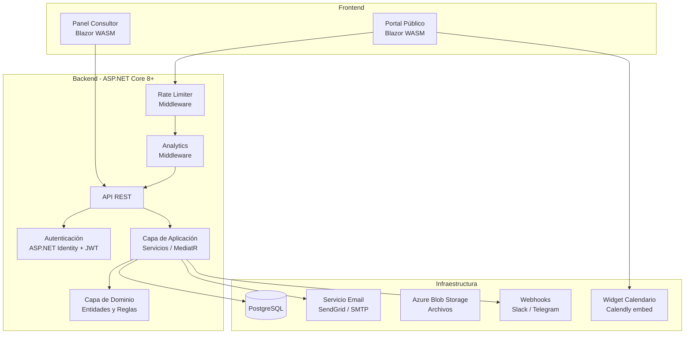
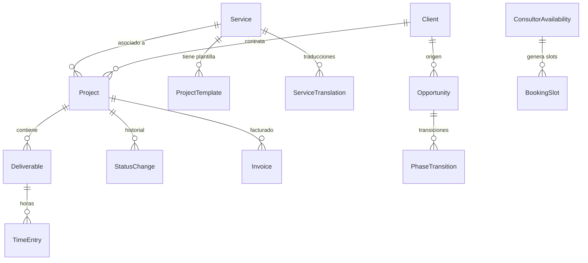
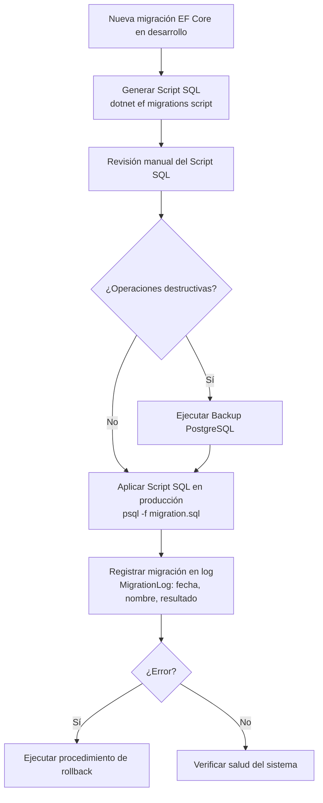

# Documento de Diseño — AI Consulting Business

## Visión General

Este documento describe el diseño técnico de la plataforma web para un negocio de consultoría de integración de IA. La plataforma se compone de dos áreas principales: un portal público orientado a la captación de clientes y un panel privado para la gestión integral del negocio (proyectos, ventas, finanzas, formación y catálogo de servicios).

El sistema se construye sobre .NET 8+ con ASP.NET Core como backend API, una base de datos relacional PostgreSQL, y un frontend que puede ser Blazor Server/WASM o React. La arquitectura sigue un patrón de capas limpias (Clean Architecture) con separación clara entre dominio, aplicación, infraestructura y presentación.

## Arquitectura

### Diagrama de Arquitectura General



### Decisiones de Arquitectura

| Decisión | Elección | Justificación |
|---|---|---|
| Patrón arquitectónico | Clean Architecture | Separación de responsabilidades, testabilidad, independencia de frameworks |
| Backend | ASP.NET Core 8+ Web API | Stack principal del consultor, rendimiento, ecosistema maduro |
| Base de datos | PostgreSQL | Open source, soporte JSON nativo, extensible con pgvector para futuro RAG |
| Autenticación | ASP.NET Identity + JWT | Integrado en el ecosistema .NET, estándar de la industria |
| Frontend | Blazor WASM (recomendado) | Reutiliza conocimiento C#, reduce cambio de contexto, componentes compartidos |
| ORM | Entity Framework Core | Migraciones, LINQ, integración nativa con ASP.NET |
| Notificaciones email | SendGrid / SMTP configurable | Envío de emails al recibir formularios de contacto |
| Webhooks | HttpClient a Slack/Telegram | Notificación instantánea ante eventos clave (contacto, reserva) |
| Rate Limiting | Rate Limiter nativo .NET 8 | Protección del endpoint público de contacto contra abuso |
| Internacionalización | Archivos .resx + campos localizados en BD | Soporte multi-idioma para UI estática y contenido dinámico |
| Analytics | Middleware personalizado + PostgreSQL | Tracking de visitas sin dependencia de servicios externos |
| SEO | Meta tags dinámicos + sitemap.xml | Posicionamiento en buscadores y previsualización en redes sociales |
| Calendario | Calendly embed / API propia | Agendamiento de llamadas de descubrimiento con visitantes |

### Estructura de Capas

```
src/
├── AiConsulting.Domain/          # Entidades, value objects, interfaces de repositorio
├── AiConsulting.Application/     # Servicios de aplicación, DTOs, validaciones
├── AiConsulting.Infrastructure/  # EF Core, repositorios, servicios externos, webhooks
├── AiConsulting.Api/             # Controllers, middleware (rate limiting, analytics), configuración
└── AiConsulting.Web/             # Frontend Blazor WASM (i18n con .resx)
```

## Componentes e Interfaces

### 1. Portal Público (Req. 1)

Componente de presentación pública que expone el catálogo de servicios, casos de éxito, sectores objetivo y formulario de contacto.

**Endpoints API:**

| Método | Ruta | Descripción |
|---|---|---|
| GET | `/api/public/services` | Lista servicios activos ordenados |
| GET | `/api/public/services/{id}` | Detalle de un servicio |
| GET | `/api/public/case-studies` | Lista casos de éxito |
| GET | `/api/public/sectors` | Lista sectores objetivo |
| POST | `/api/public/contact` | Enviar formulario de contacto (rate limited: 5/IP/15min) |

**Interfaz del servicio:**

```csharp
public interface IPublicPortalService
{
    Task<IReadOnlyList<ServiceSummaryDto>> GetActiveServicesAsync();
    Task<ServiceDetailDto?> GetServiceByIdAsync(Guid id);
    Task<IReadOnlyList<CaseStudyDto>> GetCaseStudiesAsync();
    Task<IReadOnlyList<SectorDto>> GetSectorsAsync();
    Task<ContactRequestResultDto> SubmitContactRequestAsync(ContactRequestDto request);
}
```

### 2. Autenticación y Autorización (Req. 2)

Gestión de identidad del consultor con ASP.NET Identity y tokens JWT.

**Endpoints API:**

| Método | Ruta | Descripción |
|---|---|---|
| POST | `/api/auth/login` | Iniciar sesión |
| POST | `/api/auth/refresh` | Renovar token |
| POST | `/api/auth/logout` | Cerrar sesión |

**Interfaz del servicio:**

```csharp
public interface IAuthService
{
    Task<AuthResultDto> LoginAsync(LoginDto credentials);
    Task<AuthResultDto> RefreshTokenAsync(string refreshToken);
    Task LogoutAsync(string userId);
}
```

### 3. Gestión de Clientes (Req. 2)

CRUD de fichas de cliente asociadas al consultor.

**Endpoints API:**

| Método | Ruta | Descripción |
|---|---|---|
| GET | `/api/clients` | Lista de clientes |
| GET | `/api/clients/{id}` | Detalle de cliente |
| POST | `/api/clients` | Crear cliente |
| PUT | `/api/clients/{id}` | Editar cliente |
| PATCH | `/api/clients/{id}/archive` | Archivar cliente |

**Interfaz del servicio:**

```csharp
public interface IClientService
{
    Task<PagedResult<ClientDto>> GetClientsAsync(ClientFilterDto filter);
    Task<ClientDto?> GetClientByIdAsync(Guid id);
    Task<ClientDto> CreateClientAsync(CreateClientDto dto);
    Task<ClientDto> UpdateClientAsync(Guid id, UpdateClientDto dto);
    Task ArchiveClientAsync(Guid id);
}
```

### 4. Pipeline de Ventas (Req. 3)

Gestión de oportunidades comerciales con flujo kanban de 5 fases.

**Endpoints API:**

| Método | Ruta | Descripción |
|---|---|---|
| GET | `/api/opportunities` | Lista oportunidades (kanban) |
| GET | `/api/opportunities/{id}` | Detalle de oportunidad |
| POST | `/api/opportunities` | Crear oportunidad |
| PUT | `/api/opportunities/{id}` | Editar oportunidad |
| PATCH | `/api/opportunities/{id}/move` | Mover a otra fase |

**Interfaz del servicio:**

```csharp
public interface IOpportunityService
{
    Task<IReadOnlyList<OpportunityGroupDto>> GetOpportunitiesByPhaseAsync();
    Task<OpportunityDto?> GetOpportunityByIdAsync(Guid id);
    Task<OpportunityDto> CreateOpportunityAsync(CreateOpportunityDto dto);
    Task<OpportunityDto> UpdateOpportunityAsync(Guid id, UpdateOpportunityDto dto);
    Task<OpportunityDto> MoveToPhaseAsync(Guid id, OpportunityPhase newPhase);
    Task<IReadOnlyList<OpportunityDto>> GetStaleOpportunitiesAsync(int daysThreshold = 14);
}
```

### 5. Gestión de Proyectos (Req. 4)

Creación de proyectos desde plantillas, seguimiento de entregables, hitos y horas.

**Endpoints API:**

| Método | Ruta | Descripción |
|---|---|---|
| GET | `/api/projects` | Lista proyectos |
| GET | `/api/projects/{id}` | Detalle de proyecto |
| POST | `/api/projects` | Crear proyecto (desde plantilla) |
| PUT | `/api/projects/{id}` | Editar proyecto |
| PATCH | `/api/projects/{id}/status` | Cambiar estado |
| POST | `/api/projects/{id}/deliverables/{did}/complete` | Marcar entregable completado |
| POST | `/api/projects/{id}/deliverables/{did}/hours` | Registrar horas |
| GET | `/api/project-templates` | Lista plantillas disponibles |

**Interfaz del servicio:**

```csharp
public interface IProjectService
{
    Task<PagedResult<ProjectSummaryDto>> GetProjectsAsync(ProjectFilterDto filter);
    Task<ProjectDetailDto?> GetProjectByIdAsync(Guid id);
    Task<ProjectDetailDto> CreateFromTemplateAsync(CreateProjectFromTemplateDto dto);
    Task<ProjectDetailDto> UpdateProjectAsync(Guid id, UpdateProjectDto dto);
    Task<ProjectDetailDto> UpdateStatusAsync(Guid id, ProjectStatus newStatus);
    Task<DeliverableDto> CompleteDeliverableAsync(Guid projectId, Guid deliverableId);
    Task<TimeEntryDto> LogHoursAsync(Guid projectId, Guid deliverableId, LogHoursDto dto);
}

public interface IProjectTemplateService
{
    Task<IReadOnlyList<ProjectTemplateDto>> GetTemplatesAsync();
    Task<ProjectTemplateDetailDto?> GetTemplateByIdAsync(Guid id);
}
```

### 6. Seguimiento Financiero (Req. 5)

Registro de facturas, gastos y proyecciones financieras a 12 meses.

**Endpoints API:**

| Método | Ruta | Descripción |
|---|---|---|
| GET | `/api/finance/summary?month={m}&year={y}` | Resumen mensual |
| GET | `/api/finance/projection` | Proyección a 12 meses |
| POST | `/api/finance/invoices` | Registrar factura |
| GET | `/api/finance/invoices` | Lista facturas |
| POST | `/api/finance/expenses` | Registrar gasto |
| GET | `/api/finance/expenses` | Lista gastos |

**Interfaz del servicio:**

```csharp
public interface IFinanceService
{
    Task<MonthlySummaryDto> GetMonthlySummaryAsync(int year, int month);
    Task<FinancialProjectionDto> GetProjectionAsync();
    Task<InvoiceDto> CreateInvoiceAsync(CreateInvoiceDto dto);
    Task<PagedResult<InvoiceDto>> GetInvoicesAsync(InvoiceFilterDto filter);
    Task<ExpenseDto> CreateExpenseAsync(CreateExpenseDto dto);
    Task<PagedResult<ExpenseDto>> GetExpensesAsync(ExpenseFilterDto filter);
}
```

### 7. Checklist de Formación (Req. 6)

Checklist plano de temas de formación con seguimiento de progreso.

**Endpoints API:**

| Método | Ruta | Descripción |
|---|---|---|
| GET | `/api/training/roadmap` | Checklist completo |
| PATCH | `/api/training/items/{id}/complete` | Marcar item completado |
| GET | `/api/training/progress` | Progreso global |

**Interfaz del servicio:**

```csharp
public interface ITrainingService
{
    Task<IReadOnlyList<TrainingChecklistItemDto>> GetRoadmapAsync();
    Task<TrainingChecklistItemDto> CompleteItemAsync(Guid itemId);
    Task<TrainingProgressDto> GetProgressAsync();
}
```

### 8. Catálogo de Servicios Configurable (Req. 7)

CRUD de servicios con control de orden, activación/desactivación y protección contra eliminación con proyectos asociados.

**Endpoints API:**

| Método | Ruta | Descripción |
|---|---|---|
| GET | `/api/services` | Lista todos los servicios (admin) |
| POST | `/api/services` | Crear servicio |
| PUT | `/api/services/{id}` | Editar servicio |
| PATCH | `/api/services/{id}/toggle` | Activar/desactivar |
| PUT | `/api/services/reorder` | Reordenar servicios |
| DELETE | `/api/services/{id}` | Eliminar servicio |

**Interfaz del servicio:**

```csharp
public interface ICatalogService
{
    Task<IReadOnlyList<ServiceDto>> GetAllServicesAsync();
    Task<ServiceDto> CreateServiceAsync(CreateServiceDto dto);
    Task<ServiceDto> UpdateServiceAsync(Guid id, UpdateServiceDto dto);
    Task<ServiceDto> ToggleServiceAsync(Guid id);
    Task ReorderServicesAsync(ReorderServicesDto dto);
    Task<DeleteServiceResultDto> DeleteServiceAsync(Guid id, bool confirmed = false);
}
```

### 9. Webhook / Notificación Instantánea (Req. 1, 11)

Servicio de notificación instantánea a canales externos (Slack, Telegram) cuando ocurren eventos clave.

**Endpoints API:**

| Método | Ruta | Descripción |
|---|---|---|
| GET | `/api/notifications/config` | Obtener configuración de webhooks |
| PUT | `/api/notifications/config` | Actualizar configuración de webhooks |

**Interfaz del servicio:**

```csharp
public interface INotificationService
{
    Task SendWebhookAsync(string eventType, object payload);
    Task<NotificationConfigDto> GetConfigAsync();
    Task<NotificationConfigDto> UpdateConfigAsync(UpdateNotificationConfigDto dto);
}
```

**Eventos que disparan webhook:**
- Nuevo formulario de contacto recibido
- Nueva reserva de llamada confirmada

### 10. Rate Limiting (Req. 1)

Middleware de protección contra abuso en el endpoint público de contacto.

**Configuración:**

```csharp
// Program.cs - Rate Limiter nativo de .NET 8
builder.Services.AddRateLimiter(options =>
{
    options.AddFixedWindowLimiter("ContactEndpoint", opt =>
    {
        opt.PermitLimit = 5;
        opt.Window = TimeSpan.FromMinutes(15);
        opt.QueueLimit = 0;
    });
    options.RejectionStatusCode = StatusCodes.Status429TooManyRequests;
});
```

**Comportamiento:**
- Límite: 5 peticiones por IP cada 15 minutos en `POST /api/public/contact`
- Respuesta al exceder: HTTP 429 Too Many Requests con header `Retry-After`

### 11. Multi-idioma / i18n (Req. 8)

Estrategia de internacionalización para el Portal Público con soporte para español e inglés.

**Estrategia dual:**
1. **Textos de interfaz estáticos**: Archivos de recursos `.resx` en Blazor WASM (`Resources/Localization/`)
2. **Contenido dinámico**: Campos localizados en la base de datos mediante tabla `ServiceTranslation`

**Endpoints API:**

| Método | Ruta | Descripción |
|---|---|---|
| GET | `/api/public/services?lang={code}` | Servicios en idioma solicitado |
| GET | `/api/public/case-studies?lang={code}` | Casos de éxito en idioma solicitado |

**Interfaz del servicio:**

```csharp
public interface ILocalizationService
{
    Task<ServiceDetailDto?> GetLocalizedServiceAsync(Guid serviceId, string languageCode);
    Task<IReadOnlyList<ServiceSummaryDto>> GetLocalizedServicesAsync(string languageCode);
}
```

**Detección de idioma:**
1. Parámetro `lang` en query string (prioridad máxima)
2. Preferencia guardada en localStorage del navegador
3. Header `Accept-Language` del navegador
4. Fallback: español (`es`)

### 12. Analytics del Portal (Req. 9)

Middleware de tracking de visitas y servicio de métricas para el Panel del Consultor.

**Endpoints API:**

| Método | Ruta | Descripción |
|---|---|---|
| GET | `/api/analytics/summary?from={date}&to={date}` | Resumen de métricas |
| GET | `/api/analytics/top-services?from={date}&to={date}` | Servicios más consultados |
| GET | `/api/analytics/traffic-sources?from={date}&to={date}` | Origen del tráfico |

**Interfaz del servicio:**

```csharp
public interface IAnalyticsService
{
    Task RecordVisitAsync(PageVisitDto visit);
    Task<AnalyticsSummaryDto> GetSummaryAsync(DateTime from, DateTime to);
    Task<IReadOnlyList<TopServiceDto>> GetTopServicesAsync(DateTime from, DateTime to);
    Task<IReadOnlyList<TrafficSourceDto>> GetTrafficSourcesAsync(DateTime from, DateTime to);
}
```

**Middleware de tracking:**
- Se ejecuta en cada request al Portal Público
- Registra: ruta, referrer, user-agent, tipo de dispositivo, hash de IP, timestamp
- No registra requests a la API del Panel Consultor

### 13. SEO del Portal (Req. 10)

Optimización para buscadores y redes sociales.

**Endpoints API:**

| Método | Ruta | Descripción |
|---|---|---|
| GET | `/api/public/sitemap.xml` | Sitemap XML generado dinámicamente |

**Interfaz del servicio:**

```csharp
public interface ISeoService
{
    Task<string> GenerateSitemapAsync();
    Task<SeoMetaDto> GetMetaForServiceAsync(Guid serviceId, string languageCode);
    Task<SeoMetaDto> GetMetaForCaseStudyAsync(Guid caseStudyId, string languageCode);
}
```

**Componentes:**
- Meta tags dinámicos (`<title>`, `<meta description>`, `<meta keywords>`) por página
- Open Graph tags (`og:title`, `og:description`, `og:image`, `og:url`) para redes sociales
- Generación automática de `sitemap.xml` con todas las páginas públicas
- URLs amigables con slugs legibles para servicios y casos de éxito

### 14. Calendario de Llamadas (Req. 11)

Integración de agendamiento de llamadas de descubrimiento con visitantes del portal.

**Endpoints API:**

| Método | Ruta | Descripción |
|---|---|---|
| GET | `/api/public/availability?date={date}` | Horarios disponibles para una fecha |
| POST | `/api/public/book` | Reservar horario |
| GET | `/api/calendar/availability` | Configuración de disponibilidad (admin) |
| PUT | `/api/calendar/availability` | Actualizar disponibilidad (admin) |

**Interfaz del servicio:**

```csharp
public interface ICalendarService
{
    Task<IReadOnlyList<AvailableSlotDto>> GetAvailableSlotsAsync(DateTime date);
    Task<BookingResultDto> BookSlotAsync(BookSlotDto dto);
    Task<IReadOnlyList<ConsultorAvailabilityDto>> GetAvailabilityConfigAsync();
    Task UpdateAvailabilityConfigAsync(IReadOnlyList<UpdateAvailabilityDto> config);
}
```

**Flujo de reserva:**
1. Visitante selecciona fecha → API devuelve slots disponibles
2. Visitante selecciona slot y proporciona nombre, email, empresa
3. Sistema confirma reserva → envía email de confirmación + webhook al consultor
4. Sistema crea oportunidad automática en pipeline fase "Contacto inicial"

## Modelos de Datos

### Diagrama Entidad-Relación



### Entidades Principales

#### Service (Servicio del Catálogo)

| Campo | Tipo | Descripción |
|---|---|---|
| Id | Guid | Identificador único |
| Name | string (200) | Nombre del servicio |
| Description | string (2000) | Descripción detallada |
| Benefits | string (2000) | Beneficios clave |
| PriceRangeMin | decimal | Precio mínimo en euros |
| PriceRangeMax | decimal | Precio máximo en euros |
| EstimatedDeliveryDays | int | Tiempo estimado de entrega |
| TargetSector | string (500) | Sector objetivo |
| SortOrder | int | Orden de visualización |
| IsActive | bool | Visible en portal público |
| Slug | string (200) | URL amigable para SEO |
| MetaTitle | string (200) | Meta title para SEO (idioma por defecto) |
| MetaDescription | string (500) | Meta description para SEO (idioma por defecto) |
| CreatedAt | DateTime | Fecha de creación |
| UpdatedAt | DateTime | Última modificación |

#### Client (Cliente)

| Campo | Tipo | Descripción |
|---|---|---|
| Id | Guid | Identificador único |
| Name | string (200) | Nombre del contacto |
| Company | string (200) | Nombre de la empresa |
| Sector | string (100) | Sector de la empresa |
| Email | string (200) | Email de contacto |
| Phone | string (50) | Teléfono |
| Notes | string (2000) | Notas libres |
| IsArchived | bool | Cliente archivado |
| CreatedAt | DateTime | Fecha de creación |
| UpdatedAt | DateTime | Última modificación |

#### Opportunity (Oportunidad de Venta)

| Campo | Tipo | Descripción |
|---|---|---|
| Id | Guid | Identificador único |
| ClientId | Guid? | Cliente asociado (opcional al inicio) |
| ContactName | string (200) | Nombre del contacto |
| ContactEmail | string (200) | Email del contacto |
| Company | string (200) | Empresa |
| Message | string (2000) | Mensaje inicial |
| EstimatedValue | decimal? | Valor estimado en euros |
| CurrentPhase | OpportunityPhase | Fase actual (enum) |
| PhaseEnteredAt | DateTime | Fecha de entrada en fase actual |
| CreatedAt | DateTime | Fecha de creación |
| UpdatedAt | DateTime | Última modificación |

**Enum OpportunityPhase:** `InitialContact`, `ProposalSent`, `Negotiation`, `ClosedWon`, `ClosedLost`

#### PhaseTransition (Transición de Fase)

| Campo | Tipo | Descripción |
|---|---|---|
| Id | Guid | Identificador único |
| OpportunityId | Guid | Oportunidad asociada |
| FromPhase | OpportunityPhase | Fase origen |
| ToPhase | OpportunityPhase | Fase destino |
| TransitionDate | DateTime | Fecha de transición |
| DaysInPreviousPhase | int | Días en la fase anterior |

#### Project (Proyecto)

| Campo | Tipo | Descripción |
|---|---|---|
| Id | Guid | Identificador único |
| ClientId | Guid | Cliente (obligatorio) |
| ServiceId | Guid | Servicio del catálogo |
| TemplateId | Guid? | Plantilla usada (si aplica) |
| Name | string (300) | Nombre del proyecto |
| Status | ProjectStatus | Estado actual |
| StartDate | DateTime? | Fecha de inicio |
| EndDate | DateTime? | Fecha de fin estimada |
| TotalEstimatedHours | decimal | Horas estimadas totales |
| ProgressPercentage | decimal | Porcentaje de avance (calculado) |
| CreatedAt | DateTime | Fecha de creación |
| UpdatedAt | DateTime | Última modificación |

**Enum ProjectStatus:** `Proposal`, `InProgress`, `Completed`, `Cancelled`

#### StatusChange (Historial de Estados del Proyecto)

| Campo | Tipo | Descripción |
|---|---|---|
| Id | Guid | Identificador único |
| ProjectId | Guid | Proyecto asociado |
| FromStatus | ProjectStatus | Estado anterior |
| ToStatus | ProjectStatus | Estado nuevo |
| ChangedAt | DateTime | Fecha del cambio |

#### Deliverable (Entregable)

| Campo | Tipo | Descripción |
|---|---|---|
| Id | Guid | Identificador único |
| ProjectId | Guid | Proyecto asociado |
| Name | string (300) | Nombre del entregable |
| Description | string (1000) | Descripción |
| EstimatedHours | decimal | Horas estimadas |
| IsCompleted | bool | Completado |
| CompletedAt | DateTime? | Fecha de completado |
| SortOrder | int | Orden dentro del proyecto |

#### TimeEntry (Registro de Horas)

| Campo | Tipo | Descripción |
|---|---|---|
| Id | Guid | Identificador único |
| DeliverableId | Guid | Entregable asociado |
| Hours | decimal | Horas dedicadas |
| Description | string (500) | Descripción del trabajo |
| Date | DateTime | Fecha del registro |

#### ProjectTemplate (Plantilla de Proyecto)

| Campo | Tipo | Descripción |
|---|---|---|
| Id | Guid | Identificador único |
| ServiceId | Guid | Servicio asociado |
| Name | string (300) | Nombre de la plantilla |
| DefaultDeliverables | JSON | Lista de entregables predefinidos |
| DefaultMilestones | JSON | Lista de hitos predefinidos |
| EstimatedTotalHours | decimal | Horas estimadas totales |

#### Invoice (Factura)

| Campo | Tipo | Descripción |
|---|---|---|
| Id | Guid | Identificador único |
| ProjectId | Guid | Proyecto asociado |
| Amount | decimal | Importe en euros |
| Description | string (500) | Concepto |
| InvoiceDate | DateTime | Fecha de factura |
| CreatedAt | DateTime | Fecha de registro |

#### Expense (Gasto)

| Campo | Tipo | Descripción |
|---|---|---|
| Id | Guid | Identificador único |
| Category | ExpenseCategory | Categoría |
| Amount | decimal | Importe en euros |
| Description | string (500) | Descripción |
| ExpenseDate | DateTime | Fecha del gasto |
| CreatedAt | DateTime | Fecha de registro |

**Enum ExpenseCategory:** `Tools`, `Training`, `Marketing`, `Infrastructure`, `Other`

#### TrainingChecklistItem (Item del Checklist de Formación)

| Campo | Tipo | Descripción |
|---|---|---|
| Id | Guid | Identificador único |
| Name | string (200) | Nombre del tema (ej: "LLMs", "RAG") |
| IsCompleted | bool | Completado |
| CompletedAt | DateTime? | Fecha de completado |
| SortOrder | int | Orden en el checklist |

#### ContactRequest (Solicitud de Contacto)

| Campo | Tipo | Descripción |
|---|---|---|
| Id | Guid | Identificador único |
| Name | string (200) | Nombre del visitante |
| Email | string (200) | Email |
| Company | string (200) | Empresa |
| Message | string (2000) | Mensaje |
| CreatedAt | DateTime | Fecha de envío |
| IsProcessed | bool | Procesada por el consultor |

#### NotificationConfig (Configuración de Webhook)

| Campo | Tipo | Descripción |
|---|---|---|
| Id | Guid | Identificador único |
| Channel | NotificationChannel | Canal (Slack / Telegram) |
| WebhookUrl | string (500) | URL del webhook |
| IsActive | bool | Activo |

**Enum NotificationChannel:** `Slack`, `Telegram`

#### ServiceTranslation (Traducción de Servicio)

| Campo | Tipo | Descripción |
|---|---|---|
| Id | Guid | Identificador único |
| ServiceId | Guid | Servicio asociado |
| LanguageCode | string (10) | Código de idioma (es, en) |
| Name | string (200) | Nombre traducido |
| Description | string (2000) | Descripción traducida |
| Benefits | string (2000) | Beneficios traducidos |
| MetaTitle | string (200) | Meta title traducido |
| MetaDescription | string (500) | Meta description traducida |

#### PageVisit (Visita al Portal)

| Campo | Tipo | Descripción |
|---|---|---|
| Id | Guid | Identificador único |
| PagePath | string (500) | Ruta de la página visitada |
| Referrer | string (500)? | Origen del tráfico |
| UserAgent | string (500) | User-Agent del navegador |
| DeviceType | string (50) | Tipo de dispositivo (Desktop, Mobile, Tablet) |
| IpHash | string (64) | Hash SHA-256 de la IP (privacidad) |
| VisitedAt | DateTime | Fecha y hora de la visita |

#### ConsultorAvailability (Disponibilidad del Consultor)

| Campo | Tipo | Descripción |
|---|---|---|
| Id | Guid | Identificador único |
| DayOfWeek | DayOfWeek | Día de la semana |
| StartTime | TimeOnly | Hora de inicio |
| EndTime | TimeOnly | Hora de fin |
| IsActive | bool | Activo |

#### BookingSlot (Reserva de Llamada)

| Campo | Tipo | Descripción |
|---|---|---|
| Id | Guid | Identificador único |
| Date | DateOnly | Fecha de la reserva |
| StartTime | TimeOnly | Hora de inicio |
| EndTime | TimeOnly | Hora de fin |
| VisitorName | string (200) | Nombre del visitante |
| VisitorEmail | string (200) | Email del visitante |
| VisitorCompany | string (200) | Empresa del visitante |
| IsConfirmed | bool | Confirmada |
| CreatedAt | DateTime | Fecha de creación |

### 15. Estrategia de Migraciones en Producción (Req. 12)

Estrategia para aplicar migraciones de EF Core en producción de forma segura, auditable y sin riesgo de pérdida de datos.

**Principios:**
- Nunca ejecutar `Database.Migrate()` ni `Database.EnsureCreated()` en producción
- Siempre generar un Script SQL revisable antes de aplicar cambios de esquema
- Registrar cada migración aplicada en un log auditable

**Flujo de Migración en Producción:**



**Generación de Script SQL:**

```bash
# Generar script SQL desde la última migración aplicada
dotnet ef migrations script <MigraciónAnterior> <MigraciónNueva> \
  --project src/AiConsulting.Infrastructure \
  --startup-project src/AiConsulting.Api \
  --output migrations/YYYYMMDD_NombreMigración.sql \
  --idempotent
```

**Detección de Operaciones Destructivas:**

El consultor debe revisar el script SQL buscando operaciones destructivas antes de aplicarlo:
- `DROP TABLE` — eliminación de tablas
- `DROP COLUMN` / `ALTER TABLE ... DROP` — eliminación de columnas
- `TRUNCATE` — vaciado de tablas

Si se detectan operaciones destructivas, es obligatorio ejecutar un backup previo.

**Modelo de Datos — MigrationLog:**

| Campo | Tipo | Descripción |
|---|---|---|
| Id | Guid | Identificador único |
| MigrationName | string (300) | Nombre de la migración aplicada |
| ScriptFileName | string (500) | Nombre del archivo SQL aplicado |
| AppliedAt | DateTime | Fecha y hora de aplicación |
| AppliedBy | string (200) | Identificador del operador |
| Result | MigrationResult | Resultado (Success, Failed, RolledBack) |
| Notes | string (2000)? | Notas adicionales o mensaje de error |

**Enum MigrationResult:** `Success`, `Failed`, `RolledBack`

**Interfaz del servicio:**

```csharp
public interface IMigrationLogService
{
    Task<MigrationLogDto> RecordMigrationAsync(RecordMigrationDto dto);
    Task<IReadOnlyList<MigrationLogDto>> GetMigrationHistoryAsync();
    Task<MigrationLogDto> UpdateMigrationResultAsync(Guid id, MigrationResult result, string? notes);
}
```

**Endpoints API:**

| Método | Ruta | Descripción |
|---|---|---|
| POST | `/api/migrations/log` | Registrar migración aplicada |
| GET | `/api/migrations/log` | Historial de migraciones |
| PATCH | `/api/migrations/log/{id}` | Actualizar resultado de migración |

**Procedimiento de Rollback:**

1. Identificar la migración que causó el error
2. Si hay backup disponible, restaurar desde el backup
3. Si no hay backup, generar script de rollback: `dotnet ef migrations script <MigraciónNueva> <MigraciónAnterior> --idempotent`
4. Revisar y aplicar el script de rollback manualmente
5. Registrar el rollback en el MigrationLog con resultado `RolledBack`

**Protección en Program.cs:**

```csharp
// PROHIBIDO en producción: NO incluir Database.Migrate() ni EnsureCreated()
// Las migraciones se aplican SOLO mediante Script SQL revisado manualmente
if (app.Environment.IsDevelopment())
{
    // Solo en desarrollo se permite seed automático (sin migraciones automáticas)
    using var scope = app.Services.CreateScope();
    var dbContext = scope.ServiceProvider.GetRequiredService<AiConsultingDbContext>();
    await SeedData.SeedAsync(dbContext);
}
```

### 16. Documentación de Despliegue (Req. 13)

Diseño de la documentación operativa para llevar la plataforma a producción de forma reproducible y segura.

**Estructura de la Documentación:**

La documentación de despliegue se organiza como un documento Markdown (`docs/DEPLOYMENT.md`) con las siguientes secciones:

**16.1 Infraestructura Mínima:**

| Componente | Requisito Mínimo |
|---|---|
| Servidor | VPS con 2 vCPU, 4 GB RAM, 40 GB SSD |
| Sistema Operativo | Ubuntu 22.04 LTS o superior |
| Runtime | .NET 10 SDK/Runtime |
| Base de Datos | PostgreSQL 15+ |
| Reverse Proxy | nginx 1.24+ o Caddy 2.7+ |
| Dominio | Dominio propio con certificado SSL (Let's Encrypt) |

**16.2 Variables de Entorno Requeridas:**

| Variable | Descripción | Ejemplo |
|---|---|---|
| `ConnectionStrings__DefaultConnection` | Cadena de conexión PostgreSQL | `Host=localhost;Database=aiconsulting_prod;Username=...;Password=...` |
| `Jwt__Key` | Clave secreta JWT (mín. 32 caracteres) | `clave-secreta-produccion-min-32-chars` |
| `Jwt__Issuer` | Emisor del token JWT | `AiConsulting.Api` |
| `Jwt__Audience` | Audiencia del token JWT | `AiConsulting.Client` |
| `Jwt__ExpiryMinutes` | Tiempo de expiración del token | `60` |
| `Webhooks__SlackUrl` | URL del webhook de Slack (opcional) | `https://hooks.slack.com/...` |
| `Webhooks__TelegramUrl` | URL del webhook de Telegram (opcional) | `https://api.telegram.org/...` |
| `ASPNETCORE_ENVIRONMENT` | Entorno de ejecución | `Production` |
| `ASPNETCORE_URLS` | URL de escucha del backend | `http://localhost:5000` |
| `AllowedCorsOrigins` | Dominio permitido para CORS | `https://midominio.com` |

**Validación de Configuración en Startup:**

```csharp
// Program.cs — Validación de configuración requerida en producción
if (!app.Environment.IsDevelopment())
{
    var requiredKeys = new[]
    {
        "ConnectionStrings:DefaultConnection",
        "Jwt:Key",
        "Jwt:Issuer",
        "Jwt:Audience"
    };

    foreach (var key in requiredKeys)
    {
        if (string.IsNullOrWhiteSpace(builder.Configuration[key]))
            throw new InvalidOperationException(
                $"La configuración '{key}' es obligatoria en producción.");
    }
}
```

**16.3 Configuración de Reverse Proxy (nginx):**

```nginx
server {
    listen 443 ssl http2;
    server_name midominio.com;

    ssl_certificate /etc/letsencrypt/live/midominio.com/fullchain.pem;
    ssl_certificate_key /etc/letsencrypt/live/midominio.com/privkey.pem;

    location / {
        proxy_pass http://localhost:5000;
        proxy_set_header Host $host;
        proxy_set_header X-Real-IP $remote_addr;
        proxy_set_header X-Forwarded-For $proxy_add_x_forwarded_for;
        proxy_set_header X-Forwarded-Proto $scheme;
    }
}

server {
    listen 80;
    server_name midominio.com;
    return 301 https://$host$request_uri;
}
```

**16.4 Backup PostgreSQL Automatizado:**

```bash
#!/bin/bash
# /opt/aiconsulting/backup.sh — Ejecutar diariamente via cron
BACKUP_DIR="/opt/aiconsulting/backups"
DB_NAME="aiconsulting_prod"
TIMESTAMP=$(date +%Y%m%d_%H%M%S)
BACKUP_FILE="${BACKUP_DIR}/${DB_NAME}_${TIMESTAMP}.sql.gz"

# Crear backup comprimido
pg_dump -U aiconsulting -h localhost $DB_NAME | gzip > "$BACKUP_FILE"

# Verificar integridad
if gunzip -t "$BACKUP_FILE" 2>/dev/null; then
    echo "[$(date)] Backup OK: $BACKUP_FILE" >> /var/log/aiconsulting-backup.log
else
    echo "[$(date)] ERROR: Backup corrupto: $BACKUP_FILE" >> /var/log/aiconsulting-backup.log
    exit 1
fi

# Retener últimos 30 días
find "$BACKUP_DIR" -name "*.sql.gz" -mtime +30 -delete
```

Cron: `0 3 * * * /opt/aiconsulting/backup.sh`

**16.5 Procedimiento de Despliegue Paso a Paso:**

1. **Backup previo**: Ejecutar `backup.sh` manualmente antes del despliegue
2. **Parar servicio**: `sudo systemctl stop aiconsulting`
3. **Aplicar migraciones**: Revisar y ejecutar Script SQL si hay cambios de esquema (ver sección 15)
4. **Desplegar binario**: Copiar nueva versión publicada a `/opt/aiconsulting/app/`
5. **Iniciar servicio**: `sudo systemctl start aiconsulting`
6. **Verificar salud**: `curl -f http://localhost:5000/health` — debe devolver HTTP 200

**16.6 CORS Restringido en Producción:**

```csharp
// Program.cs — CORS diferenciado por entorno
if (builder.Environment.IsDevelopment())
{
    builder.Services.AddCors(options =>
        options.AddPolicy("BlazorWasm", policy =>
            policy.AllowAnyOrigin().AllowAnyMethod().AllowAnyHeader()));
}
else
{
    var allowedOrigins = builder.Configuration["AllowedCorsOrigins"]
        ?? throw new InvalidOperationException("AllowedCorsOrigins es obligatorio en producción.");

    builder.Services.AddCors(options =>
        options.AddPolicy("BlazorWasm", policy =>
            policy.WithOrigins(allowedOrigins.Split(','))
                  .AllowAnyMethod()
                  .AllowAnyHeader()));
}
```

**16.7 Health Check Endpoint:**

```csharp
// Program.cs
builder.Services.AddHealthChecks()
    .AddNpgSql(builder.Configuration.GetConnectionString("DefaultConnection")!);

// ...
app.MapHealthChecks("/health");
```

**16.8 Procedimiento de Diagnóstico ante Caídas:**

1. Verificar estado del servicio: `sudo systemctl status aiconsulting`
2. Revisar logs de la aplicación: `journalctl -u aiconsulting --since "1 hour ago"`
3. Verificar estado de PostgreSQL: `sudo systemctl status postgresql` y `pg_isready`
4. Verificar conectividad del reverse proxy: `sudo nginx -t` y `curl -I https://midominio.com`
5. Verificar espacio en disco: `df -h`
6. Si el servicio no responde, reiniciar: `sudo systemctl restart aiconsulting`

## Propiedades de Corrección

*Una propiedad es una característica o comportamiento que debe cumplirse en todas las ejecuciones válidas de un sistema — esencialmente, una declaración formal sobre lo que el sistema debe hacer. Las propiedades sirven como puente entre especificaciones legibles por humanos y garantías de corrección verificables por máquinas.*

### Propiedad 1: Round-trip de solicitud de contacto con webhook y oportunidad

*Para cualquier* solicitud de contacto válida (nombre, email, empresa y mensaje no vacíos), al enviarla a través de la API y luego consultarla, los datos recuperados deben coincidir exactamente con los datos enviados, debe existir una oportunidad asociada en fase "Contacto inicial", y si hay una configuración de webhook activa, el webhook debe haberse disparado.

**Valida: Requisitos 1.2, 3.3**

### Propiedad 2: Validación de formulario de contacto con campos vacíos

*Para cualquier* combinación de campos obligatorios vacíos en una solicitud de contacto, la API debe rechazar la solicitud y devolver un mensaje de error específico por cada campo faltante, sin crear ningún registro.

**Valida: Requisito 1.6**

### Propiedad 3: Servicios públicos muestran solo activos con campos completos

*Para cualquier* conjunto de servicios en el catálogo (activos e inactivos), la API pública debe devolver únicamente los servicios con IsActive=true, cada uno con nombre, descripción, beneficios y rango de precio presentes, y en el orden definido por SortOrder.

**Valida: Requisitos 1.1, 7.3, 7.4**

### Propiedad 4: Round-trip de clientes

*Para cualquier* cliente generado aleatoriamente con nombre, empresa, sector, email, teléfono y notas válidos, al crearlo y luego consultarlo por su Id, los datos devueltos deben coincidir con los datos enviados.

**Valida: Requisito 2.2**

### Propiedad 5: Proyecto siempre asociado a cliente y servicio

*Para cualquier* intento de creación de proyecto, si ClientId es nulo o vacío, la operación debe ser rechazada con un error de validación. Si ClientId y ServiceId son válidos, el proyecto creado debe tener ambas asociaciones.

**Valida: Requisitos 2.3, 4.6**

### Propiedad 6: Historial de estados del proyecto

*Para cualquier* proyecto existente y cualquier cambio de estado válido, al actualizar el estado debe crearse un registro StatusChange con la fecha del cambio, el estado anterior y el estado nuevo, y el historial debe contener todos los cambios realizados en orden cronológico.

**Valida: Requisito 2.6**

### Propiedad 7: Endpoints protegidos requieren autenticación

*Para cualquier* endpoint del Panel_Consultor, una solicitud sin token JWT válido debe recibir una respuesta HTTP 401 Unauthorized.

**Valida: Requisito 2.5**

### Propiedad 8: Transiciones de fase registran tiempo

*Para cualquier* oportunidad y cualquier movimiento entre fases, debe crearse un PhaseTransition con la fecha de transición y el cálculo correcto de días en la fase anterior (diferencia entre fecha de transición y PhaseEnteredAt).

**Valida: Requisito 3.2**

### Propiedad 9: Oportunidades agrupadas por fase (kanban)

*Para cualquier* conjunto de oportunidades, la API debe devolverlas agrupadas por fase, y cada oportunidad debe pertenecer exactamente a uno de los 5 grupos de fase válidos.

**Valida: Requisitos 3.1, 3.4**

### Propiedad 10: Cerrado ganado solicita creación de proyecto

*Para cualquier* oportunidad movida a la fase "Cerrado ganado", la respuesta de la API debe indicar que se requiere la creación de un proyecto asociado.

**Valida: Requisito 3.5**

### Propiedad 11: Valor estimado de oportunidad persiste correctamente

*Para cualquier* oportunidad y cualquier valor decimal positivo asignado como valor estimado, al consultar la oportunidad el valor devuelto debe coincidir con el registrado.

**Valida: Requisito 3.6**

### Propiedad 12: Alerta de oportunidad estancada

*Para cualquier* oportunidad cuya PhaseEnteredAt sea anterior a 14 días respecto a la fecha actual, el sistema debe marcarla como estancada. Para oportunidades con menos de 14 días en la fase actual, no debe marcarse.

**Valida: Requisito 3.7**

### Propiedad 13: Creación de proyecto desde plantilla genera entregables

*Para cualquier* plantilla de proyecto, al crear un proyecto desde ella, el proyecto resultante debe contener entregables y horas estimadas derivados de la plantilla, con una correspondencia 1:1 entre los entregables de la plantilla y los del proyecto.

**Valida: Requisito 4.2**

### Propiedad 14: Cálculo de porcentaje de avance

*Para cualquier* entidad con elementos completables (entregables de un proyecto o items del checklist de formación), el porcentaje de avance debe ser igual a (elementos completados / total de elementos) × 100, redondeado a dos decimales.

**Valida: Requisitos 4.4, 6.2**

### Propiedad 15: Round-trip de registro de horas

*Para cualquier* entregable de un proyecto y cualquier registro de horas válido (horas > 0, descripción no vacía, fecha válida), al registrarlo y consultarlo, los datos deben coincidir.

**Valida: Requisito 4.5**

### Propiedad 16: Beneficio neto es ingresos menos gastos

*Para cualquier* conjunto de facturas y gastos en un mes dado, el beneficio neto del resumen mensual debe ser exactamente igual a la suma de importes de facturas menos la suma de importes de gastos de ese mes.

**Valida: Requisitos 5.1, 5.2**

### Propiedad 17: Round-trip de gastos

*Para cualquier* gasto generado aleatoriamente con categoría válida, importe positivo, descripción y fecha, al registrarlo y consultarlo, los datos devueltos deben coincidir con los enviados.

**Valida: Requisito 5.3**

### Propiedad 18: Proyección financiera cubre 12 meses

*Para cualquier* estado financiero actual, la proyección debe devolver exactamente 12 entradas mensuales, cada una con ingresos, gastos y beneficio neto proyectados.

**Valida: Requisitos 5.4, 5.5**

### Propiedad 19: Alerta de resultado negativo mensual

*Para cualquier* mes donde la suma de gastos supera la suma de ingresos, el resumen mensual debe incluir una alerta de resultado negativo. Para meses con ingresos >= gastos, no debe incluir alerta.

**Valida: Requisito 5.6**

### Propiedad 20: Round-trip de servicios del catálogo

*Para cualquier* servicio generado aleatoriamente con nombre, descripción, beneficios, rango de precio, tiempo estimado de entrega, sector objetivo y slug válidos, al crearlo y consultarlo, los datos devueltos deben coincidir con los enviados.

**Valida: Requisitos 7.1, 7.2**

### Propiedad 21: Eliminación de servicio con proyectos requiere confirmación

*Para cualquier* servicio que tiene proyectos asociados, intentar eliminarlo sin el flag de confirmación debe ser rechazado. Con el flag de confirmación, la eliminación debe proceder.

**Valida: Requisito 7.5**

### Propiedad 22: Rate limiting en endpoint de contacto

*Para cualquier* dirección IP, las primeras 5 peticiones POST al endpoint de contacto dentro de una ventana de 15 minutos deben ser aceptadas (HTTP 200/201), y la sexta petición dentro de la misma ventana debe ser rechazada con HTTP 429 Too Many Requests e incluir el header Retry-After.

**Valida: Requisitos 1.7, 1.8**

### Propiedad 23: Webhook de notificación al crear contacto

*Para cualquier* solicitud de contacto válida, si existe una configuración de webhook activa (NotificationConfig con IsActive=true), el sistema debe enviar una petición HTTP al WebhookUrl configurado con los datos del contacto. Si no hay configuración activa, no debe intentar enviar webhook.

**Valida: Requisito 1.2**

### Propiedad 24: Contenido localizado por idioma

*Para cualquier* servicio que tiene una ServiceTranslation para un idioma dado, al solicitar el servicio con ese código de idioma, la API debe devolver el nombre, descripción y beneficios de la traducción correspondiente. Si no existe traducción para el idioma solicitado, debe devolver el contenido en el idioma por defecto (español).

**Valida: Requisitos 8.1, 8.3**

### Propiedad 25: Registro de visitas incrementa contadores

*Para cualquier* visita registrada al Portal Público, el total de visitas en el periodo que contiene esa visita debe incrementarse en exactamente 1, y la visita debe contener página, referrer, user-agent, tipo de dispositivo y hash de IP.

**Valida: Requisitos 9.1, 9.3**

### Propiedad 26: Métricas de analytics filtradas por periodo

*Para cualquier* rango de fechas consultado, todas las métricas devueltas (visitas totales, únicos, páginas más vistas, origen del tráfico) deben corresponder exclusivamente a visitas registradas dentro de ese rango.

**Valida: Requisitos 9.2, 9.5**

### Propiedad 27: Ranking de servicios más consultados

*Para cualquier* conjunto de visitas a páginas de servicios, el ranking devuelto debe estar ordenado de mayor a menor número de visitas, y la suma de visitas del ranking debe coincidir con el total de visitas a páginas de servicios.

**Valida: Requisito 9.4**

### Propiedad 28: Sitemap contiene todas las páginas públicas

*Para cualquier* conjunto de servicios activos y casos de éxito, el sitemap.xml generado debe contener una URL por cada servicio activo y cada caso de éxito, usando sus slugs como parte de la URL.

**Valida: Requisitos 10.2, 10.5**

### Propiedad 29: Meta tags generados para servicios

*Para cualquier* servicio con MetaTitle y MetaDescription definidos, la función de generación de meta tags debe producir un resultado que incluya title, description, y Open Graph tags (og:title, og:description, og:url) con los valores del servicio.

**Valida: Requisitos 10.1, 10.3**

### Propiedad 30: Reserva de llamada crea oportunidad y dispara webhook

*Para cualquier* reserva válida (nombre, email, empresa no vacíos, slot disponible), al confirmarla debe crearse un BookingSlot con IsConfirmed=true, una oportunidad en fase "Contacto inicial" con los datos del visitante, y si hay webhook activo, debe dispararse la notificación.

**Valida: Requisitos 11.2, 11.3, 11.5**

### Propiedad 31: Round-trip de disponibilidad del consultor

*Para cualquier* configuración de disponibilidad (día de la semana, hora inicio, hora fin), al guardarla y consultarla, los datos devueltos deben coincidir con los enviados, y los slots disponibles para una fecha que corresponda a ese día deben reflejar la configuración.

**Valida: Requisito 11.4**

### Propiedad 32: Prohibición de migraciones automáticas en producción

*Para cualquier* configuración de entorno de producción, al iniciar la aplicación, el pipeline de startup no debe ejecutar `Database.Migrate()` ni `Database.EnsureCreated()`. Solo en entorno de desarrollo se permite la ejecución de seed automático.

**Valida: Requisito 12.2**

### Propiedad 33: Detección de operaciones destructivas en scripts SQL

*Para cualquier* script SQL de migración que contenga sentencias `DROP TABLE`, `DROP COLUMN` o `TRUNCATE`, el analizador de scripts debe identificarlas como operaciones destructivas y señalar que se requiere un backup previo.

**Valida: Requisito 12.5**

### Propiedad 34: Round-trip de registro de migraciones

*Para cualquier* migración registrada con nombre, fecha y resultado válidos, al consultarla en el historial de migraciones, los datos devueltos deben coincidir con los registrados, incluyendo nombre de migración, fecha de aplicación y resultado.

**Valida: Requisito 12.6**

### Propiedad 35: Validación de configuración requerida en producción

*Para cualquier* configuración de producción a la que le falte alguna de las claves obligatorias (ConnectionStrings:DefaultConnection, Jwt:Key, Jwt:Issuer, Jwt:Audience), el inicio de la aplicación debe fallar con un error claro indicando la clave faltante. Si todas las claves están presentes, el inicio debe completarse correctamente.

**Valida: Requisito 13.2**

### Propiedad 36: CORS restringido en producción

*Para cualquier* configuración de entorno de producción, la política CORS no debe permitir cualquier origen (`AllowAnyOrigin`). Debe estar restringida a los dominios especificados en la configuración `AllowedCorsOrigins`.

**Valida: Requisito 13.6**

## Manejo de Errores

### Estrategia General

El sistema utiliza un enfoque consistente de manejo de errores basado en Result Pattern para la capa de aplicación y Problem Details (RFC 7807) para las respuestas HTTP.

### Categorías de Error

| Categoría | Código HTTP | Ejemplo |
|---|---|---|
| Validación | 400 Bad Request | Campos obligatorios vacíos, email inválido, importe negativo |
| Autenticación | 401 Unauthorized | Token JWT ausente, expirado o inválido |
| No encontrado | 404 Not Found | Cliente, proyecto u oportunidad inexistente |
| Conflicto de negocio | 409 Conflict | Eliminar servicio con proyectos sin confirmación, slot ya reservado |
| Rate limiting | 429 Too Many Requests | Más de 5 peticiones por IP en 15 minutos al endpoint de contacto |
| Error interno | 500 Internal Server Error | Fallo de base de datos, servicio de email no disponible |

### Formato de Respuesta de Error

```json
{
  "type": "https://tools.ietf.org/html/rfc7807",
  "title": "Validation Error",
  "status": 400,
  "detail": "Uno o más campos de validación fallaron.",
  "errors": {
    "Name": ["El nombre es obligatorio."],
    "Email": ["El formato del email no es válido."]
  }
}
```

### Reglas de Validación por Entidad

- **ContactRequest**: Name, Email, Company y Message son obligatorios. Email debe tener formato válido.
- **Client**: Name y Email son obligatorios. Email debe ser único por consultor.
- **Project**: ClientId y ServiceId son obligatorios. Name es obligatorio.
- **Opportunity**: ContactName y ContactEmail son obligatorios. EstimatedValue debe ser >= 0 si se proporciona.
- **Invoice**: ProjectId, Amount (> 0) e InvoiceDate son obligatorios.
- **Expense**: Category, Amount (> 0) y ExpenseDate son obligatorios.
- **Service**: Name, Description, PriceRangeMin y PriceRangeMax son obligatorios. PriceRangeMin <= PriceRangeMax. Slug debe ser único y contener solo caracteres URL-safe.
- **ServiceTranslation**: ServiceId, LanguageCode, Name y Description son obligatorios. LanguageCode debe ser un código ISO válido soportado.
- **BookingSlot**: VisitorName, VisitorEmail y VisitorCompany son obligatorios. El slot debe estar disponible (no reservado previamente).
- **NotificationConfig**: Channel y WebhookUrl son obligatorios. WebhookUrl debe ser una URL válida.
- **MigrationLog**: MigrationName y ScriptFileName son obligatorios. Result debe ser un valor válido del enum MigrationResult.

### Manejo de Fallos Externos

- **Servicio de email**: Si el envío de notificación falla, la solicitud de contacto se persiste igualmente y se marca para reintento. Se registra el error en logs.
- **Webhook (Slack/Telegram)**: Si el envío del webhook falla, la operación principal (contacto o reserva) se completa igualmente. El fallo se registra en logs para reintento manual.
- **Base de datos**: Las operaciones de escritura usan transacciones. Si falla, se hace rollback completo y se devuelve 500.

## Estrategia de Testing

### Enfoque Dual: Tests Unitarios + Tests Basados en Propiedades

La estrategia de testing combina tests unitarios para casos específicos y edge cases con tests basados en propiedades (PBT) para verificar comportamientos universales.

### Herramientas

| Herramienta | Propósito |
|---|---|
| xUnit | Framework de testing principal |
| FsCheck (con FsCheck.Xunit) | Property-based testing para .NET |
| FluentAssertions | Aserciones legibles |
| NSubstitute | Mocking de dependencias |
| Bogus | Generación de datos de prueba |
| Microsoft.AspNetCore.Mvc.Testing | Tests de integración de API |

### Tests Unitarios

Los tests unitarios cubren:
- Ejemplos específicos de comportamiento correcto (ej: dashboard muestra los 3 componentes)
- Edge cases (ej: proyecto sin entregables tiene 0% de avance)
- Condiciones de error (ej: crear proyecto sin cliente devuelve error de validación)
- Integración entre componentes (ej: formulario de contacto crea oportunidad)

### Tests Basados en Propiedades (PBT)

Cada propiedad definida en la sección de Propiedades de Corrección se implementa como un test PBT individual usando FsCheck.

**Configuración:**
- Mínimo 100 iteraciones por test de propiedad
- Cada test debe referenciar la propiedad del documento de diseño con un comentario
- Formato de etiqueta: `Feature: ai-consulting-business, Property {número}: {texto de la propiedad}`

**Ejemplo de estructura de test PBT:**

```csharp
/// Feature: ai-consulting-business, Property 16: Beneficio neto es ingresos menos gastos
[Property(MaxTest = 100)]
public Property BeneficioNeto_Es_Ingresos_Menos_Gastos()
{
    return Prop.ForAll(
        Arb.From<List<Invoice>>(),
        Arb.From<List<Expense>>(),
        (invoices, expenses) =>
        {
            var totalIngresos = invoices.Sum(i => i.Amount);
            var totalGastos = expenses.Sum(e => e.Amount);
            var summary = _financeService.CalculateMonthlySummary(invoices, expenses);
            return summary.NetProfit == totalIngresos - totalGastos;
        });
}
```

### Organización de Tests

```
tests/
├── AiConsulting.Domain.Tests/          # Tests unitarios del dominio
├── AiConsulting.Application.Tests/     # Tests unitarios y PBT de servicios
├── AiConsulting.Api.Tests/             # Tests de integración de API
└── AiConsulting.Properties.Tests/      # Tests PBT de propiedades de corrección
```

### Cobertura de Propiedades

Cada una de las 36 propiedades de corrección se implementa como un test PBT individual en `AiConsulting.Properties.Tests`. Los tests unitarios complementan cubriendo los ejemplos específicos y edge cases identificados en los requisitos que no son propiedades universales (criterios 2.1, 4.1, 4.3, 6.1, 8.2, 8.4, 11.1, 11.6, 13.5).
